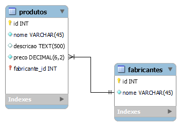
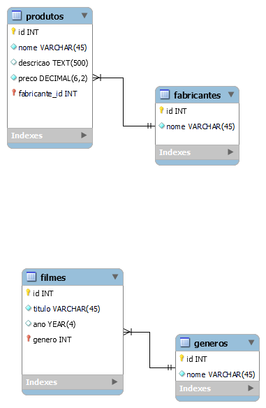

# Modelagem lógica usando MySQL Workbench

Atividades de estudo de modelagem de banco de dados. 

## Exemplo de Modelagem Lógica

## Sobre tipos de relacionamento

### 1:1

Relacionamento **1 para 1**.

### 1:n

Relacionamento do tipo **1 para n**, ou seja **1 para vários**.

### n:m

Relacionamento do tipo **n para m**, ou seja, **vários  para vários**

