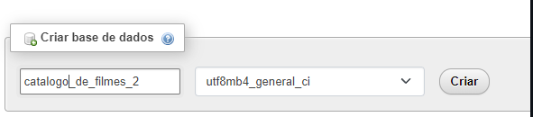
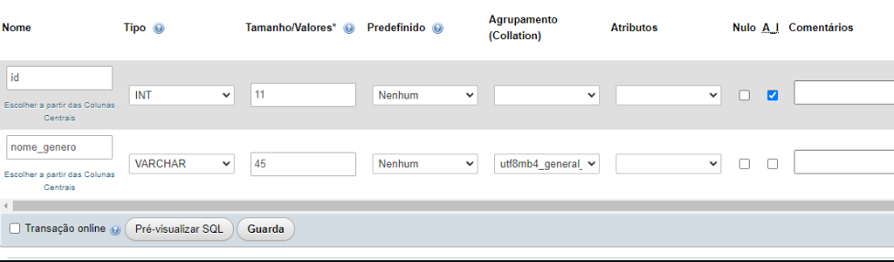
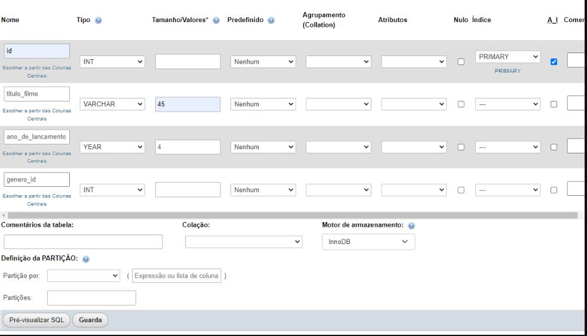
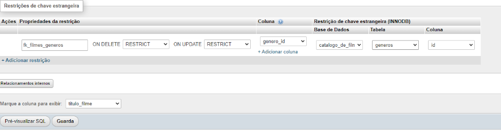
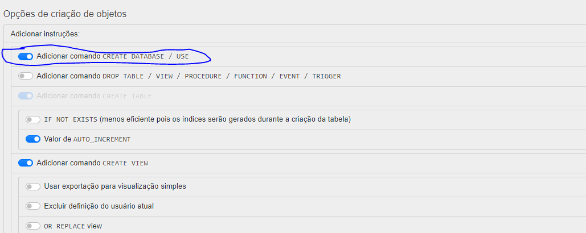

<!-- SQL pelo phpMyadmin -->

etapa 1



etapa 2



etapa 3


etapa 4


etapa 5
Para fazer backup.
- Clique na pasta que quer fazer backup 
- Vai em exportar  
- Personalizada - exibir todas as opções possíveis 
- Escolha Adicionar comando CREATE DATABASE / USE
- exportar



<!-- SQL pelo VCStudio -->
<!-- para criar uma pasta no phpmyadmin -->
CREATE DATABASE catalago_de_filme CHARACTER SET utf8mb4;


<!-- Criar tabela genero que fizemos no MySQL Workbench com está na foto modelo logico filme -->
```sql
CREATE TABLE generos(
    id INT NOT NULL PRIMARY KEY AUTO_INCREMENT,
    nome_genero VARCHAR(45) NOT NULL    
); 
```

<!-- Criar tabela filme que fizemos no MySQL Workbench com está na foto modelo logico filme -->
```sql
CREATE TABLE filmes(
    id INT NOT NULL PRIMARY KEY AUTO_INCREMENT,
    titulo_fime VARCHAR(45) NOT NULL,
    ano_de_lancamento YEAR(4) NOT NULL,    
    genero_id INT NOT NULL
);
```

```sql
-- modificar gereno o correto era generos
    ALTER TABLE genero RENAME TO generos;
```


<!-- Criar ligação das tabelas e Criando a chave-estrangeira que fizemos no MySQL Workbench com está na foto modelo logico filme -->
```sql
ALTER TABLE filmes
    
    ADD CONSTRAINT fk_filmes_generos    
    FOREIGN KEY (genero_id) REFERENCES generos(id);
```

