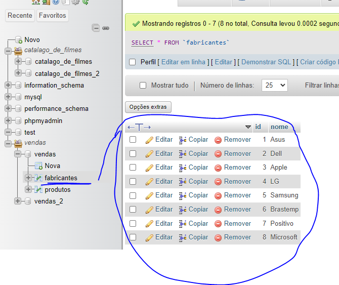
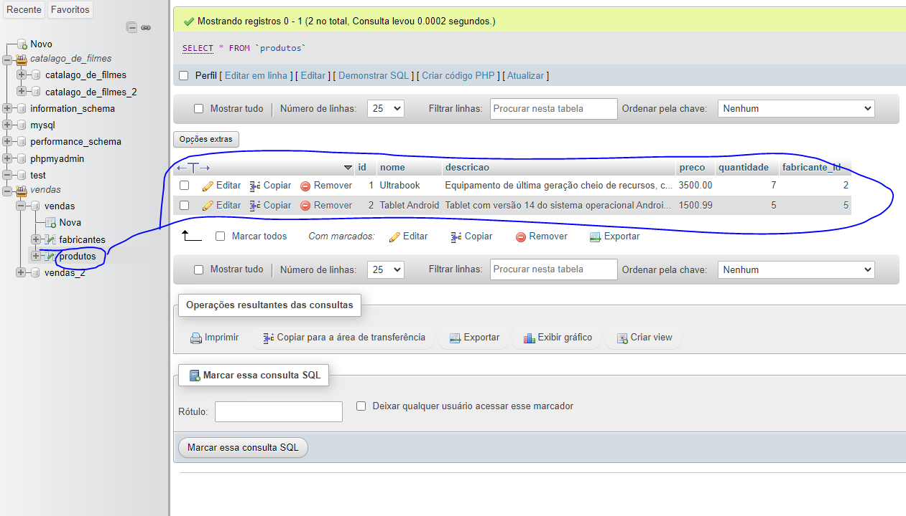

# Comandos para operações CRUD Banco de Dados

## Resumo

- C -> (inserir dados usando comando `INSERT`)
- R -> (ler dados usando comando `SELECT`)
- U -> (atualizar dados usando comando `UPDATE`)
- D -> (excluir dados usando comando `DELETE`)

## INSERT

### Fabricantes
<!-- Vamos incluir os nomes do fabricantes na tapela Fabricantes que tem o ID e nome -->

```sql
-- INSERT -> insere só nome o ID o banco que vai gerar(AI)
INSERT INTO fabricantes (nome) VALUES('Asus');
```

```sql
-- INSERT -> vazer com duas linhas
INSERT INTO fabricantes (nome) VALUES('Dell');
INSERT INTO fabricantes (nome) VALUES('Apple');
```

```sql
-- INSERT -> vazer com uma linha
INSERT INTO fabricantes (nome) 
VALUES('LG'), ('Samsung'), ('Brastemp');


INSERT INTO fabricantes (nome) 
VALUES('Positivo'), ('Microsoft');

```



### Produtos
<!-- vamos inserir na tabela prodturos o que foi pedido no caso nome, preco, descricao, quantidade, fabricante_id-->

```sql
-- Linha 1
INSERT INTO produtos (
         nome, preco, descricao, quantidade, fabricante_id) 
    VALUES (
        'Ultrabook',
        3500,
        'Equipamento de última geração cheio de recursos, com processador Inter Core i9 do balacobaco',
        7,
        2    --id do fabricante Dell    
        --no fabricante quero associar esse Ultrabook com o fabricante Dell está na segunda posição id2
    );

-- Linha 2 
INSERT INTO produtos (
         nome, descricao, preco,  quantidade, fabricante_id) 
    VALUES (
        'Tablet Android',        
        'Tablet com versão 14 do sistema operacional Android, possui tela de 10 polegadas e armazenamento de 128 GB, e 64 GB de RAM.',
        1500.99,
        5,
        5   --id do fabricante Samsung           
    );

-- Linha 3 , Linha  4 e Linha 5
INSERT INTO produtos (
         nome, descricao, preco,  quantidade, fabricante_id) 
    VALUES (
        'Geladeira',        
        'Refrigerador frost-free com acesso à Internet.',
        5000,
        12,
        6   --id do fabricante Brastemp           
    ), -- Linha 3

    (
        'iPhone 18 pro Max',
        'Smartphone Apple cheio de frescuras e caro pra caramba.',
        12666.66,
        3,  
        3
    ),-- Linha 4

    (
        'iPad Mini',
        'Tablet Apple com tela retina display e bla bla bla.',
        4999.01,
        5,  
        3
    );-- Linha 5


    INSERT INTO produtos (
         nome, descricao, preco,  quantidade, fabricante_id) 
    VALUES (
        'Xbox Serie S',        
        'Velocidade e desempenho de última geração.',
        1997.00,
        5,
        8   --id do fabricante Microsoft           
    ), -- Linha 6

    (
        'Notebook Motion',
        'Intel Dual Core 4GB de RAM, 128GB SSD e Tela 14,1 polegadas.',
        1213.65,
        8,  
        7 --id do fabricante Positivo
    );-- Linha 7 


```




---
---

## SELECT
<!-- SELECT ler dados que estão no FROM (tabela) -->

<!-- O * é para ler todos os dados da tabela(FROM)-->
```sql
SELECT * FROM produtos;
```

<!-- para ler o nome e preço da tabela(FROM) é só escrever o nome que você deu para esses campos-->
```sql
SELECT nome, preco FROM produtos;
```

<!-- para ler o preço e depois o nome da tabela(FROM) é só escrever o nome que você deu para esses campos-->
```sql
SELECT preco, nome FROM produtos;
```

<!-- para ler o mesmo de cima, porém com criterio coloque o WHERE e o que você precisa -->
```sql
SELECT  nome, preco, quantidade FROM produtos WHERE preco < 5000 ;
```


```sql
--Exercício :Mostre nome e descrição somente dos produtos da Apple
SELECT  nome, descricao FROM produtos WHERE fabricante_id = 3 ;
```

### Usar SELECT com Operadores Lógicos: E(AND), OU(OR), NÂO(NOT)


#### E (AND)
```sql
--Ver os produtos que custa entre 2 mil e 6 mil (Usado o operador logico E (AND) ) da tabela 
SELECT  nome, preco FROM produtos WHERE preco >= 2000 AND preco <= 6000;

--A query abaixo não retorna o resgistro. Já que as condicões não foram totalmente atendidas
SELECT  nome, preco FROM produtos WHERE preco > 5000 AND preco <= 6000;

```


#### OU (OR)
```sql
SELECT  nome, preco FROM produtos WHERE preco > 5000 OR preco <= 3000;
```

<!-- Exercício exiba nome e preço somente dos produtos da apple(3) e da Samsung(5) Usamos o OR(Ou), 
pois não tem como o produto ser fabricado pelo mesmos fabricantes, é um ou outro fabricante -->
```sql
SELECT  nome, preco FROM produtos WHERE fabricante_id = 3 OR fabricante_id = 5;

-- Versão usando IN() Dentro -- Mostrar os fabricante apple(3) e da Samsung(5) 
SELECT  nome, preco FROM produtos WHERE fabricante_id IN(3,5);

-- Versão usando NOT IN() Dentro -- Não Mostrar os fabricante apple(3) e da Samsung(5)
SELECT  nome, preco FROM produtos WHERE fabricante_id NOT IN(3,5);
```


#### NÃO (NOT)
```sql
--Mostrar nome, preço e descrição de todos, menos da Microsoft(8)
SELECT  nome, descricao, preco FROM produtos WHERE NOT fabricante_id = 8;

--Versão usando operador relacional "diferença/diferente != " dar o mesmo resultado de cima
SELECT  nome, descricao, preco FROM produtos WHERE  fabricante_id != 8;

```


## UPDATE
<!-- UPDATE alterar dados que estão no FROM (tabela) -->

```sql
--Trocar nome dos fabricantes de Asus(1) para Asus do Brasil

UPDATE fabricantes SET nome = 'Asus do Brasil' WHERE id = 1;  -- ☠️ NÃO SE ESQUEÇA DO WHERE!! PERIGO
--☠️ NÃO SE ESQUEÇA DO WHERE!! PERIGO ☠️

-- Alterar o preço do iPhone 18 pro Max vamos pegar o id do produto não do fabricante
UPDATE produtos SET preco = 6549.74 WHERE id = 4; -- ☠️ NÃO SE ESQUEÇA DO WHERE!! PERIGO ☠️

--Alterar DECIMAL do preço para mais casas decimal do registro
--Como é registro mudamos com ALTER TABLE
```

```sql
-- Altere a quantidade dos produtos da Apple(3) e da Samsung(5) para 20 unidades
UPDATE produtos SET quantidade = 20  WHERE fabricante_id IN (3,5);

```


## DELETE
<!-- DELETE deleta dados que estão no FROM (tabela) -->
<!-- ☠️ NÃO SE ESQUEÇA DO WHERE!! PERIGO senão deleta tudo ☠️ -->

```sql
--Apagar fabricante  Assus(1)
DELETE FROM fabricantes  WHERE id = 1;  -- ☠️ NÃO SE ESQUEÇA DO WHERE!! PERIGO! Senão deleta tudo ☠️ 

--Apagar fabricante  LG(4)
DELETE FROM fabricantes  WHERE id = 4;  -- ☠️ NÃO SE ESQUEÇA DO WHERE!! PERIGO! Senão deleta tudo ☠️


--Apagar fabricante  Apple(3), vai dar erro, poís tem produtos associado. 
--  DELETE FROM fabricantes  WHERE id = 3;  -- ☠️ NÃO SE ESQUEÇA DO WHERE!! PERIGO! Senão deleta tudo ☠️
-- A quary NÃO FUNCIONA devido a restrição de chave estrangeira/relacionamento, ou seja,
-- existem porduto associados ao fabricante 3 (apple)
```


## SELECT: outras formas de uso 

### Classificando

```sql
-- ORDER BY odernar/classificar  Esse tem nome ASC(padrão), mas não recisa escrever vai automatico
SELECT  nome, preco FROM produtos ORDER BY nome;
SELECT  nome, preco FROM produtos ORDER BY preco;

-- ORDER BY preço DESC  odernar/classificar decrescente
SELECT  nome, preco FROM produtos ORDER BY preco DESC;


--Ordena só os produtos com quantidade de 20 unidades
SELECT  nome, preco FROM produtos WHERE quantidade = 20 ORDER BY nome ;

```

### Busca de dados 

```sql
-- procura palavras
SELECT nome, descricao FROM produtos WHERE descricao LIKE '%tela%' OR nome LIKE '%tela%';

-- Usamos o operador LIKE  e o caractere coringa % para permitir uma busca
-- da palavra indicada em qualquer posição dentro do texto. Neste contexto, 
-- %   significa 'qualquer texto' antes da palavra ou depois da palavra. 

```

### Operações e funcões de agregação 

```sql

-- consulta/SOMA todos os preços -- SAM/soma
 SELECT SUM(preco) FROM produtos; 

 SELECT SUM(preco) as Total FROM produtos; -- alias/apelido

 -- Exemplo de alias/apelido para outras colunas
 SELECT nome as PRODUTO, preco as "Preço" FROM produtos;


 --MEDIA/AVG tirar a media
 SELECT AVG(preco) as "Média dos Preços" FROM produtos; 

-- fazer a media com arredondamento
 SELECT ROUND(AVG(preco)) as "Média dos Preços" FROM produtos; 

 -- fazer a media com arredondamento e casas decimais 
 SELECT ROUND( AVG(preco), 2 ) as "Média dos Preços" FROM produtos;


-- CONTAGEM 
SELECT COUNT( id ) as "Qtd de Produtos" FROM produtos; 

--Contar na tabela produtos quantos fabricantes que tem produtos estão na tabela 
SELECT COUNT( DISTINCT fabricante_id ) as "Qtd de Produtos com Produtos" FROM produtos; 
-- DISTINCT é uma cláusula/flag  que evita a duplicidade na contagem de registro. Para não pegar os repididos

```


### Operações matemáticas

```sql
-- (preco * quantidade) vai gerar uma coluna que não existe e fazer a conta
SELECT nome, preco, quantidade, (preco * quantidade) as Total FROM produtos;
```

### Segmentação/Agrupamento de resultados 
```sql
--modificar o produto para outro fabricante 
UPDATE produtos SET fabricante_id = 2 WHERE Id = 2;


SELECT fabricante_id, SUM( preco ) as Total FROM produtos GROUP BY fabricante_id;

```


